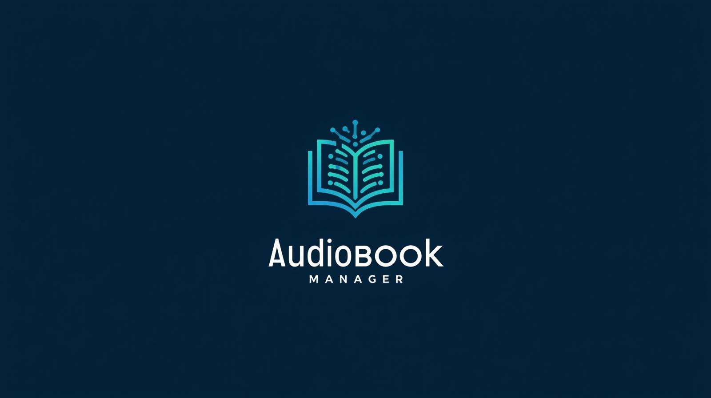

# 🎧 Audiobook Master

<div align="center">



**Convertisseur d'audiobooks en `.m4b` avec CLI Python + interface web Flask + intégration Audiobookshelf.**

</div>

---

## ✨ État actuel du projet

Audiobook Master est **opérationnel** sur 2 parcours principaux :

1. **Traitement audio local** via CLI (`python -m core.main`)
2. **Orchestration web** via Flask (`python -m web.app`)

Le dépôt contient aussi des wrappers legacy (`run.py`, `start_web.py`) conservés pour compatibilité, mais dépréciés au profit des entrées module.  

## 🧱 Architecture rapide

| Zone | Rôle |
|---|---|
| `core/` | Pipeline conversion audio, config, diagnostics, métadonnées |
| `web/` + `templates/` | API Flask + interface HTML |
| `integrations/` | Client Audiobookshelf |
| `plugins/` | Plugins métadonnées / covers / exports |
| `tests/` | Suite de tests (smoke, unitaires, API) |
| `docs/` | Documentation détaillée maintenue |

## 🚀 Démarrage rapide

### Prérequis
- Python **3.10+**
- `ffmpeg` disponible dans le `PATH`
- (Optionnel) `ollama` pour génération de synopsis IA

### Installation

```bash
python -m venv .venv
source .venv/bin/activate
pip install -r requirements.txt
```

### Exécution

```bash
# CLI
python -m core.main --source /chemin/source --output /chemin/output

# Web
python -m web.app
```

## 🧪 Validation minimale

```bash
pytest -q tests/test_smoke_suite.py
```


## 🔖 Versionnage automatique (M.m.f)

Le projet utilise désormais un versionnage **M.m.f** automatique, indépendant des numéros de sprint.

- `M.m` : base fonctionnelle définie dans `VERSION_BASE` (ex: `2.2`)
- `f` : compteur de commits Git (`git rev-list --count HEAD`)
- Version runtime exposée: `vM.m.f`

Vous pouvez forcer une version explicite avec `AUDIOBOOK_MANAGER_VERSION`, ou piloter les composants via `AUDIOBOOK_VERSION_BASE` / `AUDIOBOOK_VERSION_PATCH`.

## 📚 Documentation

- Utilisation (CLI/Web/API) : `docs/usage.md`
- Installation locale & Docker : `docs/INSTALLATION.md`
- Développement : `docs/DEVELOPER.md`
- CI/CD : `docs/ci-cd.md`
- Plugins : `docs/plugin-registry-spec.md`
- Roadmap : `ROADMAP.md`
- Suivi de tâches : `TODO.md`

---

## ⚠️ Compatibilité legacy

- `run.py` ➜ délègue vers `core.main` (déprécié)
- `start_web.py` ➜ délègue vers `web.app` (déprécié)

Ces scripts restent présents pour éviter les ruptures dans les environnements existants.
