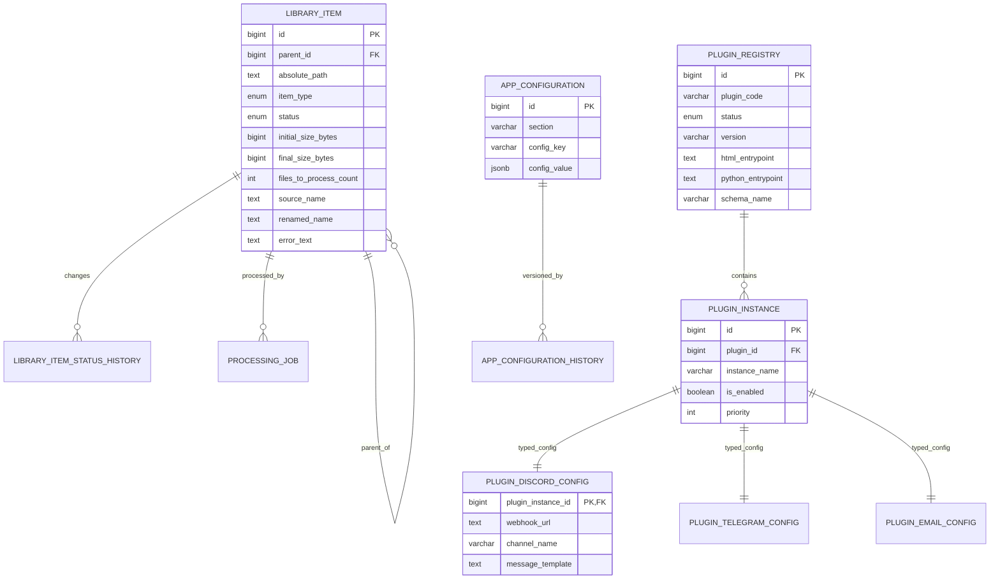

# Architecture de base de données proposée — Scan input + workflow de traitement

## Objectifs

- Persister **tout** ce qui est découvert dans le dossier `input` (fichiers, dossiers, archives).
- Normaliser le cycle de vie via un statut métier unique.
- Conserver l'historique des transitions d'état (audit / observabilité).
- Centraliser les paramètres globaux dans `app_configuration`.
- Donner aux plugins leur **propre système de configuration**, sans stocker `plugins.discord|telegram|email` dans `app_configuration`.

## Modèle relationnel (vue d'ensemble)

## Typage des objets scannés

`library_item.item_type`:

- `FILE`
- `FOLDER`
- `ARCHIVE`

## Statuts métiers

`library_item.status` couvre le workflow demandé:

1. `NEW`
2. `VALID`
3. `DECOMPRESSED`
4. `RENAMED`
5. `PROCESSING_PENDING`
6. `PROCESSING`
7. `PROCESSED`
8. `DELETED`
9. `ERROR`

### Règles métier associées

- Une archive décompressée reste le **même enregistrement** (`id` inchangé) avec:
  - `status = 'DECOMPRESSED'`
  - `item_type` mis à jour de `ARCHIVE` vers `FOLDER`.
- Après traitement réussi (génération du `.m4b`), l'élément bascule de `FOLDER` vers `FILE` avec `status = 'PROCESSED'`.
- La contrainte SQL `ck_library_item_processed_is_file` garantit que `PROCESSED => FILE`.
- En cas d'échec, `status = 'ERROR'` + détail dans `error_text`.
- Lors de suppression physique, marquer `status = 'DELETED'` et `deleted_at`.

## Mapping explicite des champs demandés

Table cible: `library_item`

- Taille initiale → `initial_size_bytes`
- Taille finale → `final_size_bytes`
- Nombre de fichiers à traiter → `files_to_process_count`
- Nom d'origine (archive/dossier) → `source_name`
- Nom renommé (dossier/fichier) → `renamed_name`
- Erreur textuelle (état 9) → `error_text`

## Configuration globale vs configuration plugin

### 1) Configuration globale (`app_configuration`)

Utilisée pour les paramètres transverses:

- `general`
- `paths`
- `audio_processing`
- `audiobookshelf`
- `ollama`

⚠️ Une contrainte SQL bloque les sections `plugins.%` dans cette table.

### 2) Registre plugins (`plugin_registry`)

Représente la zone UI sous la forme demandée:

- `plugins > INSTALLED - discord`
- `plugins > INSTALLED - telegram`
- `plugins > INSTALLED - email`

Le registre stocke:

- identité plugin (`plugin_code`, `display_name`),
- état d'installation (`INSTALLED`, `DISABLED`, `UNINSTALLED`, `ERROR`),
- métadonnées runtime (version, points d'entrée HTML/Python, schéma SQL).

### 3) Instances plugin (`plugin_instance`)

Permet de configurer un plugin **plusieurs fois**:

- ex: `discord-prod`, `discord-staging`, `discord-alertes-critiques`.

Chaque instance est ensuite reliée à une table de config spécialisée.

### 4) Config spécialisées par plugin

- `plugin_discord_config`
- `plugin_telegram_config`
- `plugin_email_config`

Chaque table porte les champs techniques spécifiques au plugin et offre une validation forte (types/contraintes SQL).

## Suggestion d'architecture d'un plugin (extensible)

Pour faciliter l'ajout de nouveaux plugins, standardiser un plugin en **3 briques**:

1. **Page HTML**
   - `plugins/<plugin_code>/templates/config.html`
   - Formulaire de gestion des `plugin_instance` + config spécialisée.

2. **SQL (migration plugin)**
   - `database/plugins/<plugin_code>/0001_init.sql`
   - Crée la table spécialisée `plugin_<plugin_code>_config`.

3. **Python runtime**
   - `plugins/<plugin_code>/service.py`
   - Chargement des instances actives, validation config, exécution des actions.

### Contrat minimal recommandé pour un nouveau plugin

- Entrée dans `plugin_registry`.
- Support multi-instance via `plugin_instance`.
- Une table `plugin_<code>_config` (1:1 avec instance).
- Un endpoint API `GET/POST /api/plugins/<code>/instances`.
- Une page UI dédiée branchée sur cet endpoint.

## Migration SQL

La migration proposée est versionnée dans:

- `database/migrations/0003_input_inventory_and_configuration.sql`

Elle introduit:

- `library_item` + historique et contrainte `PROCESSED => FILE`
- `app_configuration` + historique (hors plugins)
- `plugin_registry`
- `plugin_instance`
- `plugin_discord_config`
- `plugin_telegram_config`
- `plugin_email_config`
- liaison `processing_job.library_item_id`
