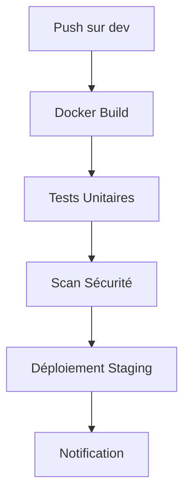
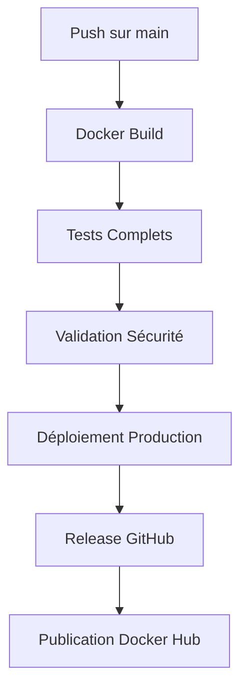
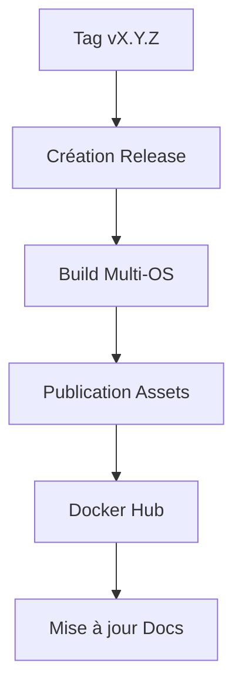

# 🚀 CI/CD Configuration - Audiobook Manager Pro

## 📋 **Overview**

Ce dossier contient la configuration complète pour l'intégration continue et le déploiement continu avec Gitea Actions.

## 🔄 **Workflows Disponibles**

### 1. **Docker Build & Deploy** (`.gitea/workflows/docker-build.yml`)
- **Déclenchement** : Push sur `main`/`dev`, Pull Requests
- **Fonctionnalités** :
  - Build multi-plateforme Docker
  - Tests de conteneurs
  - Déploiement automatique (staging/production)
  - Scan de sécurité (Trivy)
  - Génération SBOM

### 2. **Test Suite** (`.gitea/workflows/test-suite.yml`)
- **Déclenchement** : Push sur `main`/`dev`, Pull Requests
- **Fonctionnalités** :
  - Tests unitaires (Python 3.8-3.11)
  - Tests d'intégration
  - Scan de sécurité (Bandit, Safety)
  - Analyse de qualité de code (Flake8, Black, MyPy)
  - Tests de performance

### 3. **Release & Publish** (`.gitea/workflows/release.yml`)
- **Déclenchement** : Tags `v*`, workflow manuel
- **Fonctionnalités** :
  - Création automatique de releases GitHub
  - Build multi-plateforme (Linux/Windows/macOS)
  - Publication sur Docker Hub
  - Mise à jour documentation

---

## ⚙️ **Configuration Requise**

### 🔐 **Secrets Gitea**

Dans les paramètres du dépôt Gitea, configurez ces secrets :

```yaml
# Secrets du dépôt
GITEA_USERNAME: votre-username-gitea
GITEA_TOKEN: votre-token-gitea
DOCKERHUB_USERNAME: votre-username-dockerhub
DOCKERHUB_TOKEN: votre-token-dockerhub
GITHUB_TOKEN: votre-token-github  # pour les releases GitHub
```

### 🏷️ **Variables d'Environnement**

```yaml
# Variables globales
REGISTRY: gitea.lamachere.fr
IMAGE_NAME: audiobook-manager-pro
```

---

## 🚀 **Processus CI/CD**

### 📥 **1. Développement (Push sur `dev`)**



#### **Étapes**
1. **Build Docker** : Création image avec tag `dev`
2. **Tests** : Suite complète de tests
3. **Sécurité** : Scan automatique
4. **Déploiement** : Environnement staging
5. **Notification** : Rapport de déploiement

### 🚀 **2. Production (Push sur `main`)**



#### **Étapes**
1. **Build Docker** : Création image avec tag `latest`
2. **Tests** : Suite complète obligatoire
3. **Sécurité** : Validation approfondie
4. **Déploiement** : Production
5. **Release** : Création release GitHub
6. **Publication** : Docker Hub

### 🏷️ **3. Release (Tag `v*`)**



#### **Étapes**
1. **Release** : Création automatique sur GitHub
2. **Build** : Multi-plateforme (Linux/Windows/macOS)
3. **Assets** : Upload des exécutables
4. **Docker** : Publication sur Docker Hub
5. **Docs** : Mise à jour automatique

---

## 📊 **Monitoring et Reporting**

### 🧪 **Tests**

#### **Coverage**
- **Codecov** : Rapport de couverture de code
- **Seuil minimum** : 80%
- **Focus** : Modules core, web, integrations

#### **Performance**
- **Benchmarks** : Comparaison avec versions précédentes
- **Memory profiling** : Détection des fuites
- **Regression testing** : Validation non-régression

### 🔍 **Sécurité**

#### **Scans Automatiques**
- **Trivy** : Vulnérabilités Docker
- **Bandit** : Sécurité code Python
- **Safety** : Dépendances vulnérables
- **SBOM** : Software Bill of Materials

#### **Rapports**
- **SARIF** : Format standardisé
- **Artifacts** : Conservation des résultats
- **GitHub Security** : Intégration native

---

## 🐳 **Docker Configuration**

### **Build Strategy**
```yaml
strategy:
  matrix:
    os: [ubuntu-latest, windows-latest, macos-latest]
    python-version: ['3.8', '3.9', '3.10', '3.11']
```

### **Registry Configuration**
```yaml
# Registry Gitea (privé)
REGISTRY: gitea.lamachere.fr
IMAGE_NAME: audiobook-manager-pro

# Docker Hub (public)
DOCKERHUB_USERNAME: fabriceaudiobook
IMAGE_NAME: audiobook-manager-pro
```

### **Image Tags**
- `latest` : Branch `main`
- `dev` : Branch `dev`
- `vX.Y.Z` : Releases
- `sha-<commit>` : Pull Requests

---

## 🚨 **Gestion des Erreurs**

### **Notifications**

#### **Slack Integration**
```yaml
- name: 📢 Notify Slack
  uses: 8398a7/action-slack@v3
  with:
    status: ${{ job.status }}
    channel: '#ci-cd'
    webhook_url: ${{ secrets.SLACK_WEBHOOK }}
```

#### **Email Notifications**
```yaml
- name: 📧 Send Email
  uses: dawidd6/action-send-mail@v3
  with:
    server_address: smtp.gmail.com
    server_port: 587
    username: ${{ secrets.EMAIL_USERNAME }}
    password: ${{ secrets.EMAIL_PASSWORD }}
    subject: "CI/CD: ${{ github.workflow }}"
    body: |
      Status: ${{ job.status }}
      Repository: ${{ github.repository }}
      Commit: ${{ github.sha }}
```

### **Retry Logic**
```yaml
- name: 🔄 Retry Step
  uses: nick-fields/retry@v2
  with:
    timeout_minutes: 10
    max_attempts: 3
    retry_on: error
    command: npm test
```

---

## 📈 **Optimisations**

### ⚡ **Performance CI/CD**

#### **Caching**
```yaml
- name: 📦 Cache Dependencies
  uses: actions/cache@v3
  with:
    path: ~/.cache/pip
    key: ${{ runner.os }}-pip-${{ hashFiles('**/requirements*.txt') }}
```

#### **Parallel Jobs**
```yaml
strategy:
  matrix:
    os: [ubuntu-latest, windows-latest]
    python-version: ['3.9', '3.11']
```

#### **Docker Layer Caching**
```yaml
- name: 🐳 Docker Build
  uses: docker/build-push-action@v5
  with:
    cache-from: type=gha
    cache-to: type=gha,mode=max
```

### 📊 **Metrics**

#### **Temps de Build**
- **Objectif** : < 10 minutes
- **Monitoring** : Graphique temps de build
- **Alertes** : Si > 15 minutes

#### **Taux de Succès**
- **Objectif** : > 95%
- **Monitoring** : Taux par branche
- **Alertes** : Si < 90%

---

## 🔧 **Maintenance**

### 🧹 **Cleanup Automatique**
```yaml
- name: 🧹 Cleanup Old Images
  run: |
    docker images ${{ env.REGISTRY }}/${{ env.IMAGE_NAME }} \
      --format "table {{.Repository}}:{{.Tag}}\t{{.ID}}" | \
      tail -n +6 | \
      awk '{print $3}' | \
      xargs -r docker rmi -f || true
```

### 📋 **Health Checks**
```yaml
- name: 🔍 Health Check
  run: |
    curl -f http://localhost:5000/health || exit 1
    timeout 300s bash -c 'until curl -f http://localhost:5000/health; do sleep 5; done'
```

---

## 📚 **Documentation**

### **Rapports Automatisés**
- **Test Results** : `test-results/`
- **Coverage Reports** : `coverage/`
- **Security Reports** : `security-reports/`
- **Performance Reports** : `performance-reports/`

### **Dashboards**
- **Gitea Actions** : Interface native
- **Codecov** : Coverage dashboard
- **Docker Hub** : Build status
- **Custom Metrics** : Grafana (optionnel)

---

## 🚀 **Déploiement**

### **Environnements**

#### **Staging** (`dev`)
- **URL** : https://staging.audiobook-manager.pro
- **Image** : `gitea.lamachere.fr/audiobook-manager-pro:dev`
- **Auto-deploy** : Oui

#### **Production** (`main`)
- **URL** : https://audiobook-manager.pro
- **Image** : `gitea.lamachere.fr/audiobook-manager-pro:latest`
- **Auto-deploy** : Oui (après validation)

### **Rollback**
```bash
# Rollback rapide vers version précédente
docker tag gitea.lamachere.fr/audiobook-manager-pro:previous gitea.lamachere.fr/audiobook-manager-pro:latest
docker-compose up -d
```

---

*Pour la configuration détaillée, consultez les fichiers de workflow dans `.gitea/workflows/`*